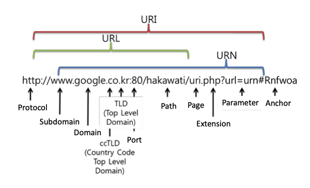
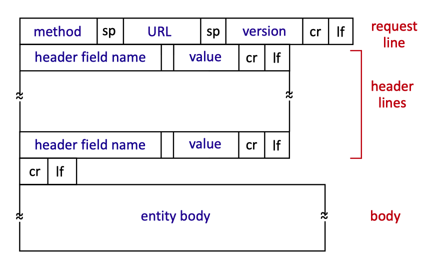
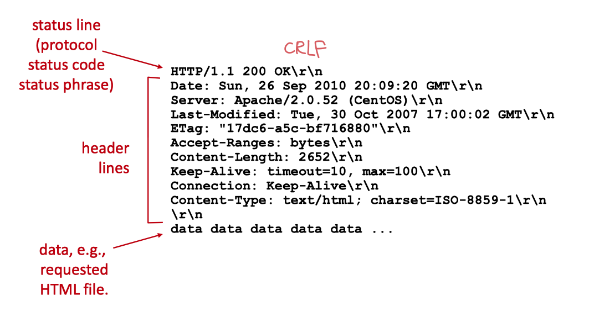
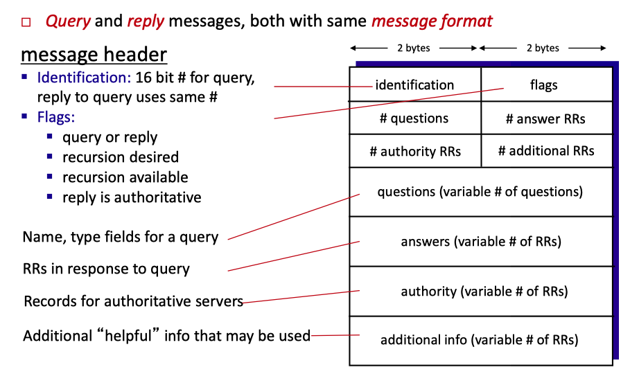

# 컴퓨터 네트워크 3 ~ 5강

> 2020-2R 고려대학교 주창희 교수님 컴퓨터네트워크  
> 교재 : Computer Networking: A top-down approach  
> 20200907

## 애플리케이션 계층 Application Layer

-   네트워크 애플리케이션을 개발 할 때는 **여러 종단 시스템에서 실행되는 소프트웨어**를 작성해야 한다.
-   네트워크 코어 장비는 네트워크 계층 및 그 하위 계층에서 기능하므로 **네트워크 코어 장비에서 실행되는 소프트웨어를 작성할 필요는 없다.**

### 애플리케이션 구조 : 클라이언트 서버 구조

> Application architecture : Client-server architecture

클라이언트-서버 구조 또는 P2P 구조로 이루어진다.

-   클라이언트-서버 구조

    1. **서버**라는 **항상 켜져있는 호스트가 존재**한다.  
       클라이언트라는 다른 많은 호스트의 요청을 받는다.

        클라이언트 호스트는 가끔 혹은 항상 켜져있을 수 있다.

    2. 서버는 **고정 IP 주소**라는 잘 알려진 주소를 갖는다.

    ex) 웹 애플리케이션: 클라이언트 호스트에서 실행되는 브라우저가 항상 켜진 웹 서버로 서비스를 요청한다.  
    웹, 파일 전송, 원격 로그인, 전자 메일 등의 예시가 있다.

    모든 요청에 응답하는게 무리인 경우 → 많은 수의 호스트를 갖춘 데이터 센터 사용

-   P2P (peer-to-peer)

    1. 항상 켜져 있는 기반구조 서버에 최소로 의존하거나, 전혀 의존하지 않는다.
       → 피어라는 간헐적으로 연결된 호스트 쌍이 직접 통신하도록 한다.
    2. 자가 확장성*Self scalability*이 있다.  
       → 규모가 커지더라도 서버 기반구조와 서버 대역폭을 요구하지 않는다.

    ex) 비트토렌트, VoIP

### 프로세스 간 통신

종단 시스템에서 실행하는 프로그램(**프로세스**)이 쌍을 이룬 형태로 컴퓨터 네트워크를 통한 **메시지** 교환으로 서로 통신한다.  
→ 클라이언트 프로세스: 브라우저 / 서버 프로세스: 웹 서버  
→ 업로드 하는 피어: 서버 / 다운로드 하는 피어: 클라이언트

> 두 프로세스 간 통신에서 통신을 초기화하는 프로세스: 클라이언트,  
> 세션을 시작하기 위해 접속을 기다리는 프로세스: 서버

### 프로세스 - 컴퓨터 네트워크 사이 인터페이스 : 소켓

> 프로세스는 소켓을 통해 네트워크로 메시지를 보내고 받는다.

소켓: 호스트의 애플리케이션 계층과 트랜스포트 계층 간의 인터페이스

애플리케이션 개발자는 소켓의 애플리케이션 계층에 대한 모든 통제권을 갖지만, 소켓의 트랜스포트 계층에 대한 통제권은 거의 갖지 못하고 버퍼나 변수를 설정하는 것 외에는 운영체제에서 제어한다.

### 프로세스 주소 배정

> 패킷을 보내기 위해서는 수신 프로세스가 주소를 갖고 있을 필요가 있다.

1. **호스트의 주소** - **IP 주소**로 식별
2. 목적지 호스트 내의 **수신 프로세스를 명시하는 식별자** _Identifier_ - **포트 번호**로 식별

### 인터넷 전송 프로토콜이 제공하는 서비스

> 인터넷은 애플리케이션에게 TCP와 UDP라는 일반적인 전송 프로토콜을 제공한다.

-   TCP 서비스
    -   **신뢰적인 데이터 전송 _Reliable transport_**
    -   혼잡 제어 _Congestion control_
    -   흐름 제어 _Flow control_
    -   **연결지향형 서비스 _Connection-oriented_**
        -   클라이언트와 서버 사이의 핸드셰이킹이 필요하다.  
            서로 전송 제어 정보를 교환 → 핸드셰이킹
-   UDP 서비스
    -   최소의 서비스 모델을 가짐.
    -   핸드셰이킹 X → 수신 소켓에 도착하는 것을 보장하지 않음. 순서도 뒤바뀔 수 있음.
    -   혼잡 제어 X → 데이터를 원하는 속도로 하위 계층(Network Layer)으로 보낼 수 있음.

### URI, URL, URN

-   Uniform Resource Identifier (URI)
-   Uniform Resource Locator (URL)
-   Uniform Resource Name (URN)

## HTTP 개요

-   HTTP (HyperText Transfer Protocol) - 웹의 애플리케이션 계층 프로토콜 _Application layer protocol_  
    → TCP, UDP : Transport layer protocol

-   **TCP를 전송 프로토콜**로 사용한다.  
    핸드셰이킹이 존재하고, 신뢰적인 데이터 전송을 보장(반드시 도착한다.)
-   HTTP 서버는 클라이언트에 대한 정보를 유지하지 않으므로, (반복되는 요청에도 계속 답하므로)  
    **비상태 프로토콜 _Stateless protocol_** 이다.

### 비지속 연결과 지속 연결

> 각 요구/응답 쌍이 분리된 TCP 연결을 통해 보내져야 하는가? → 비지속 (하나 받고 끊고 다시 열고)  
> 모든 요구와 해당하는 응답들이 같은 TCP 연결상으로 보내져야 하는가? → 지속 (계속해서 열어두다가 끊음)

#### 비지속 연결 HTTP _Non-persistent HTTP_

-   각 요구/응답이 분리된 TCP 연결을 통해 보내지므로 TCP 연결을 초기화하는 (핸드셰이킹) 시간이 걸리기 때문에 계속해서 소켓(자원)이 생성되고 소멸되므로 새로운 TCP 연결이 추가적인 딜레이를 낳게 된다.  
    → TCP 버퍼 할당, TCP 변수들이 클라이언트와 서버 양쪽에 유지되어야 함. (새로운 연결 설정)
-   **RTT _Round-trip time_**  
    → **작은 패킷**이 클라이언트로부터 서버까지 가고, 다시 클라이언트로 되돌아오는 데 걸리는 시간
-   비지속 연결에서의 총 응답시간 = 2 RTT (TCP 연결 설정 + 객체 요청하고 수신) + 파일 전송 시간

#### 지속 연결 HTTP _Persistent HTTP_

-   객체에 대한 요구가 진행 중인 요구에 대한 응답을 기다리지 않고 연속해서 만들어질 수 있음 (_Pipelining_)

#### HTTP 1.1 and HTTP/2

> https://medium.com/@factoryhr/http-2-the-difference-between-http-1-1-benefits-and-how-to-use-it-38094fa0e95b

-   HTTP/2에서 **같은 연결상에서 다중 요청과 응답이 가능**하도록 제안됨. → 한꺼번에 요청 와르르

### HTTP Server Architecture

-   Single-Threaded Web Server
-   Multi Threaded Web Server
    -   요청에 대해 여러 Worker thread를 만들어서 처리함.
    -   **Main thread → handling requests**
    -   **Data transfer is handled by worker threads.**
-   Thread Pool Web Server
    -   Worker thread가 요청을 처리한 후 destroy되지 않고 재사용됨.

### HTTP 메시지 포맷

-   CRLF(Carriage Return + Line Feed)로 각 줄이 구별된다.

-   HTTP Request Message Format

    

-   HTTP Response Message Format

#### HTTP 응답 상태 코드

-   200 OK  
    → 요청이 성공되었고, 정보가 응답으로 보내졌다.
-   301 Moved Permanently  
    → 요청 객체가 영구히 이동됨. 새로운 URL은 응답 메시지의 Location: 에 기재되어 있다.
-   400 Bad Request  
    → 서버가 요청을 이해할 수 없다.
-   404 Not Found  
    → 요청 서버가 서버에 존재하지 않는다.
-   505 HTTP Version Not Supported  
    → 요청 HTTP 프로토콜 버전을 서버가 지원하지 않음.

### 서버와 사용자 간의 상호작용: 쿠키

-   쿠키의 네가지 요소
    1. HTTP 응답 메시지 쿠키 헤더 라인
    2. HTTP 요청 메시지 쿠키 헤더 라인
    3. 사용자의 브라우저에서 관리하는 쿠키 파일
    4. 웹 사이트의 백엔드 데이터베이스

### 웹 캐싱 _Web cache; Proxy server_

-   웹 캐시를 통한 클라이언트의 객체 요청

    1. 브라우저는 웹 캐시(프록시 서버)와 연결을 설정하고 객체에 대한 HTTP 요청을 보낸다.
    2. 웹 캐시는 객체의 사본을 가지고 있는지 확인하고, 저장되어 있다면 HTTP 응답 메시지와 함께 객체를 전송한다.
    3. 웹 캐시가 객체를 가지고 있지 않다면, 원출처의 서버(기점 서버; Origin server)로 TCP 연결을 설정하고 객체에 대한 HTTP 요청을 보낸다. 요청을 받은 기점 서버는 웹 캐시로 HTTP 응답 메시지와 함께 객체를 보낸다.
    4. 웹 캐시가 객체를 수신할 때, 객체를 지역 저장장치(Local DB)에 복사하고 클라이언트 브라우저에 HTTP 응답 메시지와 함께 객체의 사본(이미 설정된 TCP 연결을 통해)을 보낸다.

-   웹 캐시는 서버이면서 클라이언트이다.

    -   브라우저로부터 요구를 받고 응답을 보냄 → 서버
    -   기점 서버에게 요구를 보내고 응답을 받음 → 클라이언트

-   웹 캐시를 사용하는 이유

    1. 클라이언트의 요구에 대한 응답 시간을 줄일 수 있다.  
       Reduce response time for client request.
    2. 한 기관(Institutional network)에서 인터넷으로 접속하는 링크상의 웹 트래픽을 대폭으로 줄일 수 있다.  
       Reduce traffic on access link.

-   접속 회선의 트래픽 강도(Access link utilization)
    1. 회선 증설 → 가격이 많이 듬
    2. 웹 캐시 설치 → 회선 증설 없이 간단하게 트래픽을 줄일 수 있다.
-   CDN(Content Distribution Network; 콘텐츠 전송 네트워크)
    -   인터넷 전역을 통해 많은 지역적으로 분산된 캐시를 설치화해서 많은 트래픽을 지역화한다.

## 전자 메일 _Electronic mail_

-   Three major components

    -   사용자 에이전트 User agents
    -   메일 서버 Mail servers
    -   SMTP; _Simple mail transfer protocol_

-   사용자 에이전트 User agent

    = Mail reader  
    Composing, editing, reading mail messages  
    Outgoing, incoming messages stored on server.

-   메일 서버 Mail servers

    -   Mailbox + message queue
    -   Mailbox  
        사용자에게 도착한 메시지를 유지하고 관리한다.
    -   Message queue  
        수신자의 메일 서버에 보낼 수 없는 경우 임시 보관하는 큐  
        재시도는 약 30분 마다 일어난다.

### SMTP Protocol

: between mail servers to send email messages  
송신자의 메일 서버로부터 수신자의 메일 서버로 메시지를 전송한다 (메일서버 - 메일서버)
인터넷 전자메일을 위한 애플리케이션 계층 프로토콜

-   TCP + 25 port number

-   모든 메일 메시지의 몸체는 단순한 7bit ASCII 여야 한다.  
    → 이진 멀티미디어 데이터를 보내기 전 ASCII로 변환해야함.
-   간단한 ASCII 메시지의 전달 경로 (앨리스 → 밥)
    1. 앨리스가 전자메일 사용자 에이전트를 수행하고 밥의 전자 메일 주소로 보내라고 명령한다.  
       Alice uses UA(User Agent) to compose message to bob.
    2. 앨리스의 사용자 에이전트는 메시지를 앨리스의 메일 서버에 보내고 메시지는 메시지의 큐에 놓이게 된다.  
       Alices's UA sends message to her mail server;  
       Message placed in message queue.
    3. 앨리스의 메일 서버에서 동작하는 SMTP 클라이언트는 메시지 큐에 있는 메시지를 보고 밥의 메일 서버에 있는 SMTP 서버에게 TCP 연결을 설정한다.  
       Client side of SMTP opens TCP connection with Bob's mail server.
    4. SMTP 핸드셰이킹 이후 SMTP 클라이언트가 앨리스의 메시지를 TCP 연결로 보낸다.  
       SMTP client sends Alice's message over the TCP connection.
    5. 밥의 메일 서버 호스트에서 SMTP 서버 측이 메시지를 수신한다. 밥의 메일 서버는 그 메시지를 밥의 메일 박스에 놓는다.  
       Bob's mail server places the message in Bob's mailbox.
    6. 밥은 편한 시간에 그 메시지를 읽기 위해 사용자 에이전트를 시동한다.  
       Bob invokes his user agent to read message.
-   간단한 SMTP Interaction
    -   HELO, MAIL FROM, RCPT TO, DATA, QUIT 와 같은 명령 존재
    -   CRLF.CRLF를 이용해 메시지가 끝이 났음을 알린다.

### HTTP와의 비교

-   정보 송수신의 관점  
    HTTP: pull (정보를 받기 위한)  
    SMTP: push (정보를 보내기 위한)

    HTTP는 누군가 서버에 정보를 올리고 사용자가 서버로부터 정보를 가져오기 위해 사용함.  
    SMTP는 정보를 수신 메일 서버로 보내는 프로토콜이다.

-   데이터의 관점  
    HTTP: 데이터에 제약이 없다.  
    SMTP: 각 메시지가 7비트 ASCII 포맷이여야 한다.

-   객체의 관점  
    HTTP: HTTP 응답 메시지에 각 객체를 캡슐화한다.  
    → Each object encapsulated in its own reponse message.  
    SMTP: 모든 메시지의 객체를 한 메시지로 만든다.  
    → Multiple objects sent in multi-part message.

### 메일 접속 프로토콜 _Mail Access Protocols_

-   SMTP: delivery/storage to receiver's server
-   Mail Access Protocol: Retrieval from server  
    → **SMTP는 서버까지만 가고, 서버에서 사용자 에이전트로 이동할 때는 MAP 사용**
-   **POP3, IMAP, HTTP**(ex, Gmail, Hotmail... Web Interface)와 같은 MAP들이 존재한다.

## DNS (Domain Name System)

-   분산 계층 데이터베이스의 형식을 가진다.  
    Distibuted database implemented in hierarchy of many name servers.
    -   중앙 집중형 구조를 취하지 않는 이유
        1. 서버의 고장 → 전체 인터넷 작동 X  
           **Single point of failure**
        2. 트래픽 양 → 단일 DNS 서버가 모든 DNS 질의를 처리해야 한다.  
           **Traffic volume**
        3. 먼 거리의 중앙 집중 데이터베이스 → 지구 반바퀴를 돌아야 할 수도 있다.  
           **Distant centralized database**
        4. 유지관리 → 모든 인터넷 호스트에 대한 레코드를 유지해야하므로 커질 수 밖에 없다.  
           **Maintenance**
-   Application-layer protocol  
    : hosts, name servers communicate to resolve names (address/name translation)

-   DNS가 제공하는 서비스  
    Host aliasing, Mail server aliasing, Load distribution, Host name translation

### DNS의 구조

-   루트 DNS 서버 _Root DNS Server_
    -   Local name server에서 resolve하지 못한 경우
-   최상위 레벨 도메인 서버 _TLD(top-level domain) Server_
    -   com, org, net, edu 같은 TLD와 kr, uk, fr, ca, jp 같은 모든 국가의 TLD 관리
    -   ex) Verisign → com TLD 서버 담당
-   책임 DNS 서버 _Authoritative DNS Server_
    -   웹 서버와 메일 서버를 가진 모든 기관은 호스트 네임을 IP 주소로 매핑하는 공개적인 DNS 레코드를 제공해야 한다.
    -   자신이 책임 DNS 서버를 구현할 수 도 있고, 서비스 제공자에게 비용을 지불하고 레코드를 저장하도록 할 수도 있다.
-   로컬 DNS 서버 _Local DNS Server_  
    → 계층에 크게 구애받지 않는다.  
    ISP가 가지고 있는 로컬 DNS 서버  
    네트워크 상태 창에 접근하여 로컬 DNS 서버의 IP 주소를 쉽게 결정할 수 있다.
    -   호스트가 DNS 쿼리를 만들면, 쿼리가 local DNS 서버로 간다.
        -   만약 local cache가 존재한다면 그 캐시를 사용하고, 없다면 프록시처럼 쿼리를 계층으로 forward한다.

### DNS Name Resolution

-   재귀적 질의 Recursive query와 반복적 질의 Iterative query
-   DNS 캐싱 DNS Caching
    -   호스트 네임과 IP 주소 쌍을 DNS 서버에 저장한다.
    -   호스트 DNS와 IP 주소 사이의 매핑과 호스트는 영구적이지 않으므로 어떤 기간 이후 삭제한다.
    -   로컬 DNS 서버는 TLD 서버의 IP 주소를 저장할 수 있으며, 질의 사슬에서 루트 DNS 서버를 우회하도록 한다.

### DNS Record

-   DNS 서버들은 호스트 네임을 IP 주소로 매핑하기 위한 자원 레코드 _Resource Record, RR_ 를 저장한다.
-   자원 레코드는 다음과 같은 필드를 포함하는 4개의 튜플(tuple)로 되어 있다.
    -   (Name, Value, Type, TTL)
        -   TTL = 자원 레코드의 생존기간
        -   Type=A
            -   Name: 호스트 네임  
                Value: 호스트 네임에 대한 IP 주소
            -   ex) (foo.com, 123.0.0.1, A)
        -   Type=NS
            -   Name: 도메인  
                Value: 도메인에 대한 책임 DNS 서버의 호스트 네임
            -   ex) (foo.com, dns.foo.com, NS)
        -   Type=CNAME
            -   Name: 별칭 호스트 네임 _Alias name for some canonical name_  
                Value: **정식 네임 _Canonical name_**
            -   ex) (foo.com, relay1.bar.foo.com, CNAME)
        -   Type=MX
            -   Name: 별칭 호스트 네임  
                Value: 별칭 호스트 네임을 갖는 메일 서버의 정식 이름
            -   ex) (foo.com, mail.bar.foo.com, MX)

### DNS Messages

### DNS 데이터베이스에 레코드 삽입

-   등록기관(DNS registrar)에 도메인의 책임 DNS 서버와 책임 DNS 서버의 IP 주소를 각각 NS, A RR로 추가한다.
-   책임 DNS 서버에서 도메인의 IP 주소를 type A RR을 통해 쓰고, 메일 서버 등을 기술한다.
