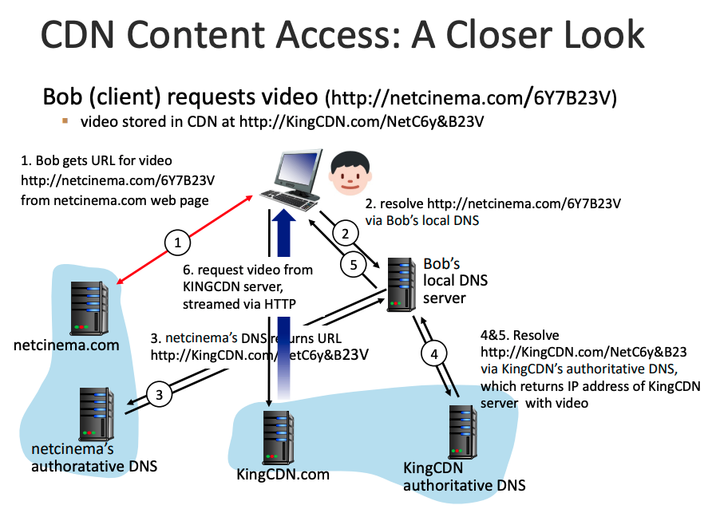

# 컴퓨터 네트워크 6강

## Application Layer

### P2P file distribution (P2P)

- 항상 켜져 있는 기반구조 서버에 **최소한(또는 거의 안함)으로 의존**한다.
  → **간헐적으로 연결되는 (Intermittently connected)** 호스트 쌍 (peer) 이 직접 통신한다.
  - No always-on server
  - Arbitrary end systems directly communicate
  - Peers are intermittenly connected and change IP addresses
- 각 피어는 수신한 파일의 임의의 부분을 다른 피어들에게 재분배함으로써 서버의 분배 프로세스를 도운다.
- BitTorrent, Streaming, VoIP 등에 사용된다.

#### Distribution Time 

분배 시간은 모든 N개의 피어들이 파일의 복사본을 얻는 데 걸리는 시간을 뜻한다.

#### File Distribution Time: Client-Server

- 서버가 무조건 N개의 copy를 전송해야 한다.
  - 하나의 카피 당 $F/u_s$ 의 시간이 소요된다.
  - N개의 카피인 경우 $NF/u_s$ 의 시간이 소요된다.
- 클라이언트는 File copy를 받아야 한다.
  - $d_\text{min}$ = 최소 클라이언트 다운로드율
  - 다운로드하는데에 걸리는 최소 시간: $F/d_\text{min}$ (client-side bottleneck)
- client-server approach에서 F를 N개의 클라이언트에 분배하는 시간
  - $D_\text{c-s} \ge \text{max}\{NF/u_s, F/d_\text{min}\}$
  - N에 대해 선형적으로 증가한다. (클라이언트 수가 많아질 수록 오래 걸림)

#### File Distribution Time: P2P

- 서버는 최소한 하나의 copy를 업로드해야 한다.
  - 하나의 copy를 올리는 시간 $F/u_s$
- 클라이언트는 File copy를 받아야 한다.
  - 다운로드하는데에 걸리는 최소 시간: $F/d_\text{min}$
- 클라이언트들이 합쳐져 총 NF 비트를 다운로드해야 한다. (network bottleneck)
  - 최대 업로드 속도는 서버와 클라이언트(피어)를 합친 $u_s + \sum u_i$
- P2P approach에서의 Distribution time
  - $D_\text{P2P} \ge \text{max}\{F/u_s, F/d_\text{min}, NF/(u_s + \sum{u_i})\}$
  - N에 대해 선형적으로 증가하지만, 피어의 수도 증가하므로 더욱 낫다.

#### P2P File Distribution: BitTorrent

- 특정 파일의 분배에 참여하는 모든 피어들의 모임 = 토렌트 *Torrent*
- 토렌트에 참여하는 피어들은 서로에게서 같은 크기의 청크 *Chunk* 를 다운로드함. (일반적으로 256kb)
  - 피어가 청크를 다운로드할 때 피어는 또한 청크를 다른 피어들에게 업로드함.
  - 한 피어가 전체 파일을 얻으면, 토렌트를 떠날 수 있거나 (Selfishly) 남아서 다른 피어들에게 청크를 업로드할 수 있다. (Altruistically)
    = Peers may come and go
- 각 토렌트는 트랙커 *Tracker* 라고 불리는 기반 구조 노드를 갖는다.
  - 한 피어가 토렌트에 가입할 때 트랙커에 자신을 등록하고 주기적으로 토렌트에 있음을 알린다.
- 새로운 피어가 토렌트에 가입하는 경우
  - 트랙커는 참여하고 있는 피어 집합에서 임의로 피어들의 부분 집합을 선택하여 (50개) IP 주소들을 보내준다.
  - 이 리스트에 있는 모든 피어들과 동시에 TCP 연결을 설정한다. (연결을 설정한 피어들을 "이웃 피어"라 부른다.)

#### BitTorrent: Requesting, Sending File Chunks

- Requesting chucks:

  - 각 피어는 파일 청크들의 일부를 갖고 있을 것이며, 서로 다른 피어들은 다른 부분을 갖고 있을 것이다.
    At any given time, different peers have different subsets of file chunks
  - 주기적으로 이웃 피어들 각각에게 그들이 갖고 있는 청크 리스트를 요구한다.
    Periodically, Ask each peer for list of chunks that they have
  - 청크 리스트를 본 뒤 가장 드문 것 먼저(Rarest first) 요구한다.
    Request missing chunks from peers, rarest first

- Sending chucks: **tit-for-tat**

  - 가장 빠른 속도로 데이터를 제공하는 4개의 피어를 결정해 청크를 보낸다. (10초마다)
    → 4개의 피어들은 **활성화(unchoked)**되었다고 한다.

  - 매 30초마다 임의로 하나의 피어를 추가로 선택하여 청크를 보낸다.
    → 이 피어를 **낙관적으로 활성화(optimistically unchoked)**되었다고 한다.

    만약 Bob이 낙관적으로 활성화되었다고 하자.
    Alice가 Bob에게 데이터를 보내고 있기 때문에 Alice는 Bob의 4개 업로더 중 하나가 될 수 있으며,
    이 경우 Bob은 Alice에게 데이터를 보내기 시작한다.
    그럼 Alice의 4개 업로더 중 Bob이 해당될 수 있고, 서로와 교역을 지속할 수 있게 된다.

  - 활성화된 4개의 피어와 낙관적으로 활성화된 1개의 피어, 즉 5개의 피어에게 업로드를 진행한다.

### Video Streaming and Content Distribution Network(CDN)

- 비디오의 중요한 특징 : 압축될 수 있다.
  → 비디오 품질과 비트 전송률은 서로 반비례(trade-off)함.
- 스트리밍 비디오에서 가장 중요한 성능 척도는 평균 종단간(end-to-end) 처리량임.
  → 네트워크는 연속재생을 제공하기 위해 압축된 비디오의 전송률 이상의 스트리밍 애플리케이션에 대한 평균 처리량을 제공해야 한다.

#### HTTP Streaming and DASH

HTTP Streaming
→ 가용 대역폭의 차이에도 불구하고 똑같이 인코딩된 비디오를 전송받는다.

**DASH *Dynamic Adaptive Streaming over HTTP***

각 비디오 버전은 HTTP 서버에 서로 다른 URL을 가지고 저장된다.
HTTP 서버는 비트율에 따른 **각 버전의 URL을 제공**하는 **Manifest** 파일을 가지고 있다.

- 서버는
  - 비디오 파일을 여러 청크로 분할한다.
    Server divides video file into multiple chunks
  - 각 청크는 서로 다른 비트율로 저장된다.
    Each chunk stored, encoded at different rates

- 클라이언트는
  - 주기적으로 서버-클라이언트 대역폭을 측정한다.
    Periodically mearsures server-to-client bandwidth
    - 측정된 수신 대역폭과 비트율 결정 알고리즘을 이용해 다음에 선택할 비디오 조각 단위 데이터의 버전을 결정한다.
  - 동적으로 서로 다른 버전의 비디오를 몇 초 분량의 길이를 가지는 비디오 조각(Chunk) 단위로 요청한다.
    Consulting manifest, requests one chunk at a time
  - HTTP GET 요청을 이용해 다른 버전의 비디오 조각을 매번 선택한다.
    Can choose different coding rates at different points in time

Client determines

- When to request chunk (버퍼가 비거나 넘치는 상황)
- What encoding rate to request (가능한 대역폭이 높을수록 높은 화질)
- Where to request chunk (가능한 최대 대역폭에 맞는 URL 서버에 요청함)

#### 콘텐츠 분배 네트워크 (CDN)

- CDN 동작
  1. 사용자가 NetCinema의 웹페이지를 방문한다.
  2. 사용자가 링크를 클릭하면, 사용자의 호스트가 DNS query를 보낸다.
  3. 사용자의 로컬 DNS 서버가 NetCinema의 책임 DNS 서버로 쿼리를 전달하고,
     책임 DNS 서버는 CDN으로 연결하기 위해 IP 주소 대신 CDN의 호스트 이름을 LDNS(local DNS)에게 알려준다.
  4. LDNS는 호스트 이름에 대한 두 번째 쿼리를 보내고, DNS에 의해 CDN 서버의 IP 주소로 변환되어 응답된다.
  5. LDNS는 콘텐츠를 제공할 CDN 서버의 IP 주소를 사용자 호스트에게 알려준다.
  6. 해당 IP주소로 TCP 연결을 설정하고 HTTP GET 요청을 전송한다.

### Socket Programming

- Two socket types for two transport services:
  - UDP: Unreliable datagram
  - TCP: Reliable, byte stream-oriented
- UDP: no "connection" between client & server
  - 데이터를 보내기 전 handshaking을 하지 않는다.
  - 송신자는 각 패킷에 도착지의 IP 주소와 포트 번호를 부착한다.
  - 수신자는 받은 패킷에서 송신자의 IP 주소와 포트 번호를 추출한다.
  - 전송된 데이터가 손실되거나 순서대로 도착하지 않을 수 있다.
    Transmitted data may be lost or received out-of-order

#### Socket Programming with TCP

- 서버는 클라이언트의 초기 접속에 응대할 수 있도록 준비하고 있어야 한다.
  1. UDP에서와 마찬가지로, TCP 서버는 클라이언트가 접속을 시도하기 전에 프로세스를 먼저 수행하고 있어야 한다.
     Server process must first be running **(= Process Ready)**
  2. 서버 프로그램은 임의의 컴퓨터에서 수행되고 있는 클라이언트로부터 초기 접속을 처리하는 소켓을 가져야 한다.
     Server must have created socket that welcomes client's contact **(= Socket Ready)**
- 클라이언트 프로세스는 서버로의 TCP 연결을 시도한다.
  1. IP 주소와 서버 프로세스의 포트 번호를 명시한 TCP 소켓을 생성한다.
     Creating TCP socket, specifying IP address, port number of server process
- 클라이언트가 서버에 접속하면, 서버는 **새로운 TCP 소켓**을 만들어 특정 클라이언트에 지정한다.
  When contacted by client, Server TCP creates new socket for server process to communicate with that particular client.
  1. 서버가 여러 클라이언트들과 통신할 수 있게 해준다.
     Allows server to talk with multiple clients
  2. 소스의 포트 번호로 클라이언트들을 구별한다.
     Source port numbers used to distinguish clients