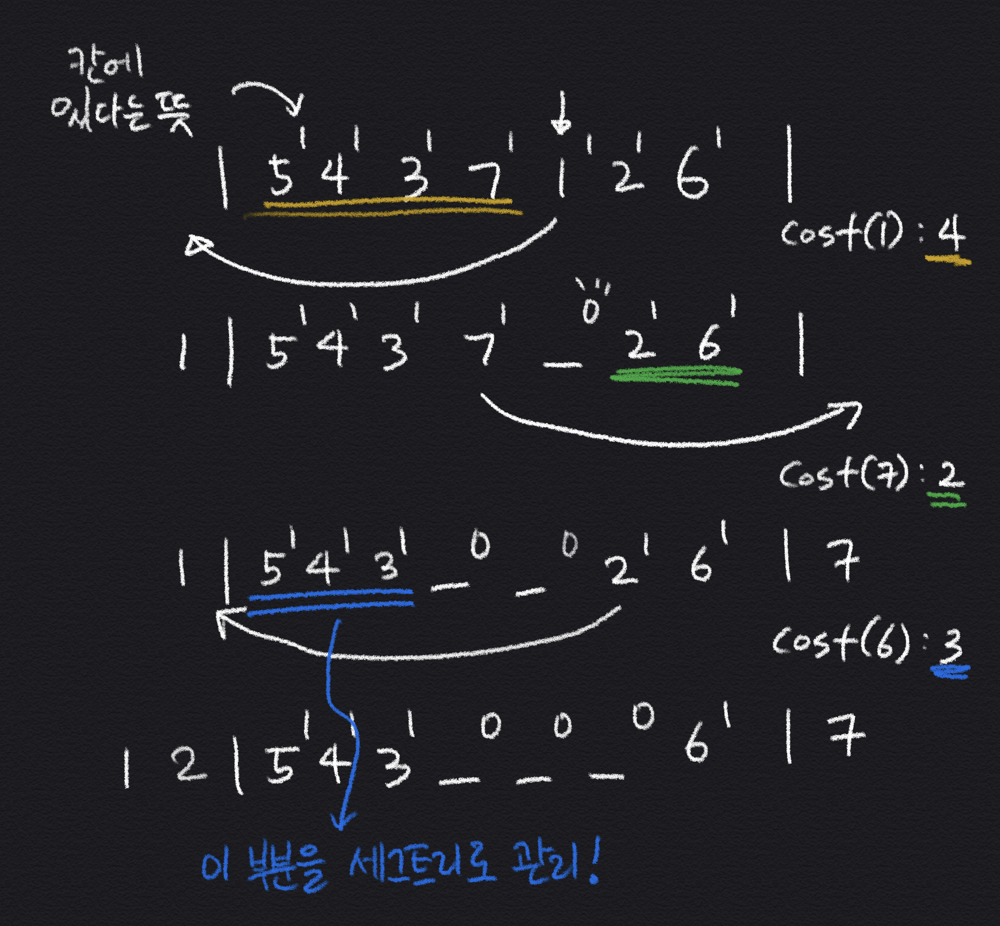

# BOJ #3006 - 터보소트

> https://www.acmicpc.net/problem/3006
>
> \# 문제 분류
> 세그먼트 트리

## 풀이 접근 방법

---

1. 정렬하면서 어떤 숫자를 옮긴다는 행위는 그 범위 밖으로 빼는 것과 같다.
2. 그 말인 즉슨, 배열의 양 옆에 테두리를 두었다 생각하고 문제의 조건대로 나타내어 보자.
3. 방문하지 않는 수 중 작은 숫자를 골라서 테두리의 왼쪽 바깥에 두고, 그 칸이 비어있다고 한자. 반대도 마찬가지로.
4. 그렇다면 세그먼트 트리를 이용해서 해당 범위에 숫자가 몇개 존재하는지만 관리해주면 된다.

크게 신박한 풀이를 요구하지는 않는데 풀고 정말 깜짝 놀랐다. 오랜만에 재밌는 문제를 만난 느낌?
문제 풀이가 잘 이해가 되지 않을 수 있는데 이미지를 하나 첨부해서 이해를 돕고자 한다.

<center>예제 3번에 관한 필기</center>

## 소스 코드

---

```c++
#include <algorithm>
#include <cstdio>
#include <iostream>
#include <utility>

using namespace std;

int N, tmp;
const int MAX = 1 << 21;
int arr[MAX], result[MAX];

struct SegTree {
    int start = MAX / 2;
    SegTree() {
        fill(arr, arr + MAX, 1);
    }

    void init() {
        for (int i = start - 1; i > 0; i--) {
            arr[i] = arr[i * 2] + arr[i * 2 + 1];
        }
    }

    int sum(int s, int e) {
        return sum(s, e, 1, 0, start - 1);
    }
    int sum(int s, int e, int node, int ns, int ne) {
        if (e < ns || ne < s)
            return 0;
        if (s <= ns && ne <= e)
            return arr[node];

        int mid = (ns + ne) / 2;
        return sum(s, e, node * 2, ns, mid) + sum(s, e, node * 2 + 1, mid + 1, ne);
    }

    void update(int idx, int value) {
        arr[start + idx] = value;
        for (int i = (start + idx) / 2; i > 0; i /= 2) {
            arr[i] = arr[i * 2] + arr[i * 2 + 1];
        }
    }
};

int main() {
    ios_base::sync_with_stdio(0);
    cin.tie(0);
    cout.tie(0);

    cin >> N;
    pair<int, int> p[N];

    for (int i = 0; i < N; i++) {
        cin >> tmp;
        p[i] = make_pair(tmp, i);
    }

    sort(p, p + N);

    SegTree st;
    st.init();
    int cnt = 0;
    while (cnt < N) {
        int currIdx = p[cnt / 2].second;
        int nextIdx = p[cnt / 2].first - 1;

        result[cnt] = st.sum(0, currIdx - 1);

        st.update(currIdx, 0);

        cnt++;
        if (cnt == N)
            break;

        currIdx = p[N - (cnt + 1) / 2].second;
        nextIdx = p[N - (cnt + 1) / 2].first - 1;

        result[cnt] = st.sum(currIdx + 1, N - 1);

        st.update(currIdx, 0);

        cnt++;
    }

    for (int i = 0; i < N; i++) {
        cout << result[i] << "\n";
    }
}
```
