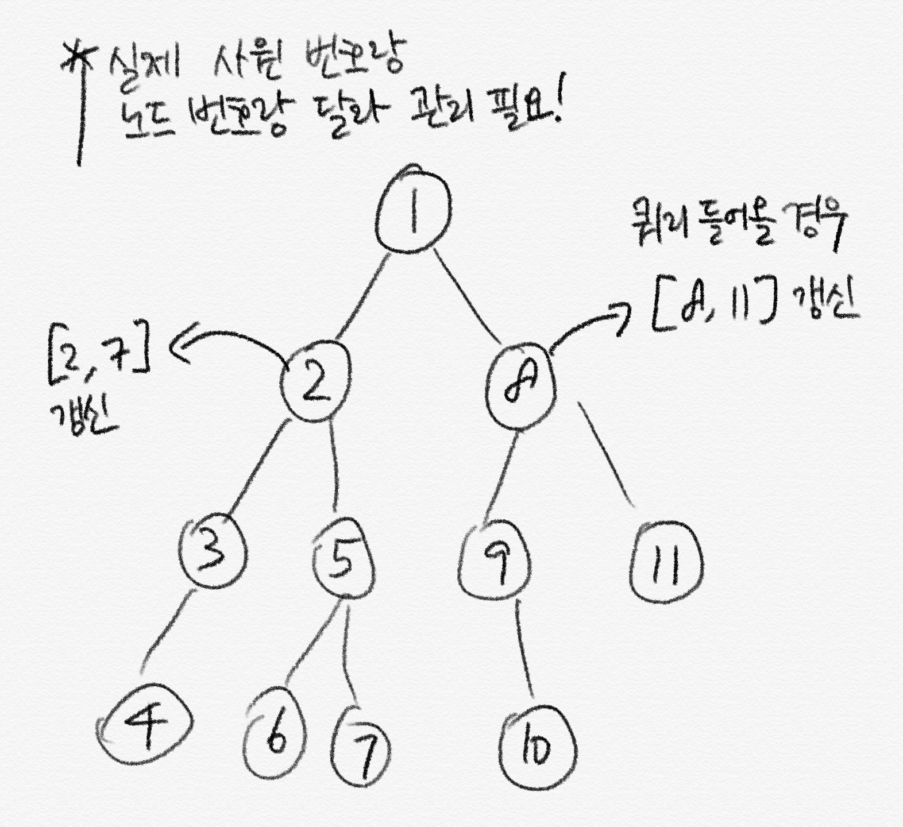

# BOJ #16404 - 주식회사 승범이네

> https://www.acmicpc.net/problem/16404

> \# 문제 분류
>
> 세그먼트 트리 with Lazy Propagation + DFS Numbering

## 풀이 접근 방법

---

1. 각각 사수 / 부사수 관계를 트리로 나타낼 수 있음은 자명합니다.
2. 이 트리를 DFS numbering으로 번호를 매겨가면서 자식 노드가 몇 개 있는지 저장해두고,
3. 쿼리가 오면 그 자식 노드를 함께 갱신시켜주면 됩니다. 물론 lazy로요!
4. 나머지는 특별한건 없네요.

넘버링과 자식 노드 관련해서 그림을 하나 첨부하겠습니다.



## 소스 코드

---

```c++
#include <bits/stdc++.h>

using namespace std;

typedef long long ll;
const int MAX_st = 1 << 18;
int arr[MAX_st], lazy[MAX_st];

struct SegTree {
    int start = MAX_st / 2;

    SegTree() {
        fill(arr, arr + MAX_st, 0);
        fill(lazy, lazy + MAX_st, 0);
    }

    void propagate(int node, int ns, int ne) {
        if (lazy[node]) {
            if (node < start) {
                lazy[node * 2] += lazy[node];
                lazy[node * 2 + 1] += lazy[node];
            }

            arr[node] += lazy[node] * (ne - ns + 1);
            lazy[node] = 0;
        }
    }

    void add(int s, int e, int k) {
        return add(s, e, k, 1, 0, start - 1);
    }
    void add(int s, int e, int k, int node, int ns, int ne) {
        propagate(node, ns, ne);
        if (e < ns || ne < s)
            return;
        if (s <= ns && ne <= e) {
            lazy[node] += k;
            propagate(node, ns, ne);
            return;
        }

        int mid = ns + ne >> 1;
        add(s, e, k, node * 2, ns, mid);
        add(s, e, k, node * 2 + 1, mid + 1, ne);
        arr[node] = arr[node * 2] + arr[node * 2 + 1];
    }

    int query(int s, int e) { return query(s, e, 1, 0, start - 1); }
    int query(int s, int e, int node, int ns, int ne) {
        propagate(node, ns, ne);
        if (e < ns || ne < s)
            return 0;
        if (s <= ns && ne <= e)
            return arr[node];

        int mid = ns + ne >> 1;
        return query(s, e, node * 2, ns, mid) + query(s, e, node * 2 + 1, mid + 1, ne);
    }
} st;

int N, M, w, p;
const int MAX = 1e5 + 10;
vector<int> adj[MAX];
int children[MAX], visited[MAX], number[MAX], c;

int dfs(int i, int level) {
    number[i] = c++;
    if (adj[i].empty()) {
        children[i] = 1;
        return 1;
    } else {
        int cnt = 1;
        for (auto &p : adj[i]) {
            cnt += dfs(p, level + 1);
        }
        children[i] = cnt;
        return children[i];
    }
}

int main() {
    ios_base::sync_with_stdio(0);
    cin.tie(0);
    cout.tie(0);

    cin >> N >> M;

    for (int i = 1; i <= N; i++) {
        cin >> p;
        if (p == -1)
            continue;
        adj[p].push_back(i);
    }

    dfs(1, 0);

    for (int k = 0; k < M; k++) {
        int p, i, w;
        cin >> p;

        if (p == 1) {
            cin >> i >> w;

            st.add(number[i], number[i] + children[i] - 1, w);
            // profit / deficit
        } else {
            cin >> i;

            cout << st.query(number[i], number[i]) << "\n";
        }
    }
}
```
