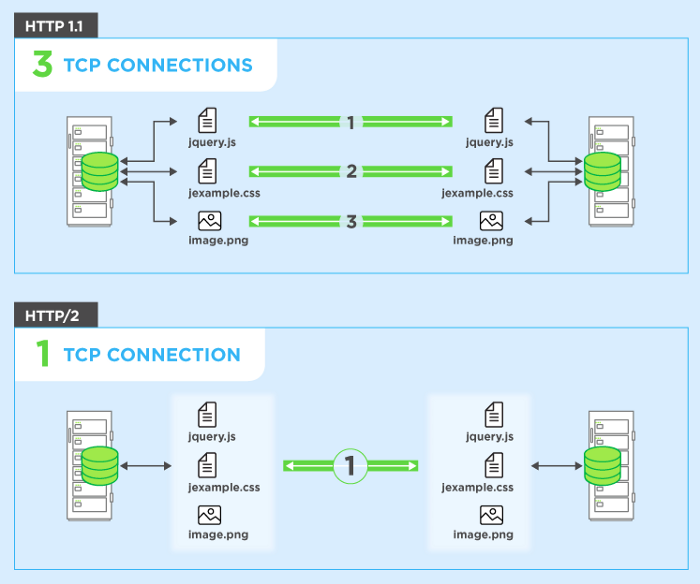
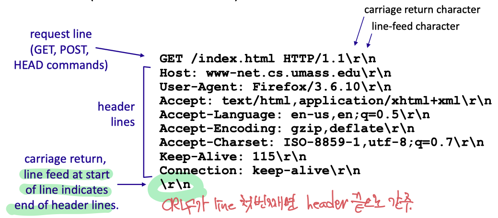

# 컴퓨터 네트워크 3강

## 애플리케이션 계층 Application Layer

- 네트워크 애플리케이션을 개발 할 때는 **여러 종단 시스템에서 실행되는 소프트웨어**를 작성해야 한다.
- 네트워크 코어 장비는 네트워크 계층 및 그 하위 계층에서 기능하므로 **네트워크 코어 장비에서 실행되는 소프트웨어를 작성할 필요는 없다.**

### 애플리케이션 구조 : 클라이언트 서버 구조

> Application architecture : Client-server architecture

클라이언트-서버 구조 또는 P2P 구조로 이루어진다.

- 클라이언트-서버 구조

  1. **서버**라는 **항상 켜져있는 호스트가 존재**한다.
     클라이언트라는 다른 많은 호스트의 요청을 받는다.

     클라이언트 호스트는 가끔 혹은 항상 켜져있을 수 있다.

  2. 서버는 **고정 IP 주소**라는 잘 알려진 주소를 갖는다.

  ex) 웹 애플리케이션: 클라이언트 호스트에서 실행되는 브라우저가 항상 켜진 웹 서버로 서비스를 요청한다.
  웹, 파일 전송, 원격 로그인, 전자 메일 등의 예시가 있다.

  모든 요청에 응답하는게 무리인 경우 → 많은 수의 호스트를 갖춘 데이터 센터 사용

- P2P (peer-to-peer)

  1. 항상 켜져 있는 기반구조 서버에 최소로 의존하거나, 전혀 의존하지 않는다.
     → 피어라는 간헐적으로 연결된 호스트 쌍이 직접 통신하도록 한다.
  2. 자가 확장성*Self scalability*이 있다.
     → 규모가 커지더라도 서버 기반구조와 서버 대역폭을 요구하지 않는다.

  ex) 비트토렌트, VoIP

### 프로세스 간 통신

종단 시스템에서 실행하는 프로그램(**프로세스**)이 쌍을 이룬 형태로 컴퓨터 네트워크를 통한 **메시지** 교환으로 서로 통신한다.
→ 클라이언트 프로세스: 브라우저 / 서버 프로세스: 웹 서버
→ 업로드 하는 피어: 서버 / 다운로드 하는 피어: 클라이언트

> 두 프로세스 간 통신에서 통신을 초기화하는 프로세스: 클라이언트,
> 세션을 시작하기 위해 접속을 기다리는 프로세스: 서버

#### 프로세스 - 컴퓨터 네트워크 사이 인터페이스 : 소켓

> 프로세스는 소켓을 통해 네트워크로 메시지를 보내고 받는다.

소켓: 호스트의 애플리케이션 계층과 트랜스포트 계층 간의 인터페이스

애플리케이션 개발자는 소켓의 애플리케이션 계층에 대한 모든 통제권을 갖지만, 소켓의 트랜스포트 계층에 대한 통제권은 거의 갖지 못하고 버퍼나 변수를 설정하는 것 외에는 운영체제에서 제어한다.

#### 프로세스 주소 배정

> 패킷을 보내기 위해서는 수신 프로세스가 주소를 갖고 있을 필요가 있다.

1. **호스트의 주소** - **IP 주소**로 식별
2. 목적지 호스트 내의 **수신 프로세스를 명시하는 식별자** *Identifier* - **포트 번호**로 식별

### 인터넷 전송 프로토콜이 제공하는 서비스

> 인터넷은 애플리케이션에게 TCP와 UDP라는 일반적인 전송 프로토콜을 제공한다.

- TCP 서비스
  - **신뢰적인 데이터 전송 *Reliable transport***
  - 혼잡 제어 *Congestion control*
  - 흐름 제어 *Flow control*
  - **연결지향형 서비스 *Connection-oriented***
    - 클라이언트와 서버 사이의 핸드셰이킹이 필요하다.
      서로 전송 제어 정보를 교환 → 핸드셰이킹
- UDP 서비스
  - 최소의 서비스 모델을 가짐.
  - 핸드셰이킹 X → 수신 소켓에 도착하는 것을 보장하지 않음. 순서도 뒤바뀔 수 있음.
  - 혼잡 제어 X → 데이터를 원하는 속도로 하위 계층(Network Layer)으로 보낼 수 있음.

### URI, URL, URN

- Uniform Resource Identifier (URI)
- Uniform Resource Locator (URL)
- Uniform Resource Name (URN)

### HTTP 개요

- HTTP (HyperText Transfer Protocol) - 웹의 애플리케이션 계층 프로토콜 *Application layer protocol*
  → TCP, UDP : Transport layer protocol

- **TCP를 전송 프로토콜**로 사용한다.
  핸드셰이킹이 존재하고, 신뢰적인 데이터 전송을 보장(반드시 도착한다.)
- HTTP 서버는 클라이언트에 대한 정보를 유지하지 않으므로, (반복되는 요청에도 계속 답하므로)
  **비상태 프로토콜 *Stateless protocol*** 이다.

### 비지속 연결과 지속 연결

> 각 요구/응답 쌍이 분리된 TCP 연결을 통해 보내져야 하는가? → 비지속 (하나 받고 끊고 다시 열고)
> 모든 요구와 해당하는 응답들이 같은 TCP 연결상으로 보내져야 하는가? → 지속 (계속해서 열어두다가 끊음)

#### 비지속 연결 HTTP *Non-persistent HTTP*

- 각 요구/응답이 분리된 TCP 연결을 통해 보내지므로 TCP 연결을 초기화하는 (핸드셰이킹) 시간이 걸리기 때문에 계속해서 소켓(자원)이 생성되고 소멸되므로 새로운 TCP 연결이 추가적인 딜레이를 낳게 된다.
  → TCP 버퍼 할당, TCP 변수들이 클라이언트와 서버 양쪽에 유지되어야 함. (새로운 연결 설정)
- **RTT *Round-trip time***
  → **작은 패킷**이 클라이언트로부터 서버까지 가고, 다시 클라이언트로 되돌아오는 데 걸리는 시간
- 비지속 연결에서의 총 응답시간 = 2 RTT (TCP 연결 설정 + 객체 요청하고 수신) + 파일 전송 시간

#### 지속 연결 HTTP *Persistent HTTP*

- 객체에 대한 요구가 진행 중인 요구에 대한 응답을 기다리지 않고 연속해서 만들어질 수 있음 (*Pipelining*)

#### HTTP 1.1 and HTTP/2

> https://medium.com/@factoryhr/http-2-the-difference-between-http-1-1-benefits-and-how-to-use-it-38094fa0e95b

- HTTP/2에서 **같은 연결상에서 다중 요청과 응답이 가능**하도록 제안됨. → 한꺼번에 요청 와르르

### HTTP Server Architecture

- Single-Threaded Web Server
- Multi Threaded Web Server
  - 요청에 대해 여러 Worker thread를 만들어서 처리함.
  - **Main thread → handling requests**
  - **Data transfer is handled by worker threads.**
- Thread Pool Web Server
  - Worker thread가 요청을 처리한 후 destroy되지 않고 재사용됨.

### HTTP 메시지 포맷

- CRLF(Carriage Return + Line Feed)로 각 줄이 구별된다.

- HTTP Request Message Format

  

- HTTP Response Message Format

#### HTTP 응답 상태 코드

- 200 OK
  → 요청이 성공되었고, 정보가 응답으로 보내졌다.
- 301 Moved Permanently
  → 요청 객체가 영구히 이동됨. 새로운 URL은 응답 메시지의 Location: 에 기재되어 있다.
- 400 Bad Request
  → 서버가 요청을 이해할 수 없다.
- 404 Not Found
  → 요청 서버가 서버에 존재하지 않는다.
- 505 HTTP Version Not Supported
  → 요청 HTTP 프로토콜 버전을 서버가 지원하지 않음.

### 서버와 사용자 간의 상호작용: 쿠키

- 쿠키의 네가지 요소
  1. HTTP 응답 메시지 쿠키 헤더 라인
  2. HTTP 요청 메시지 쿠키 헤더 라인
  3. 사용자의 브라우저에서 관리하는 쿠키 파일
  4. 웹 사이트의 백엔드 데이터베이스
